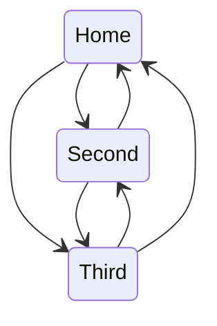
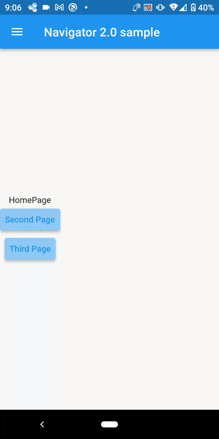

# navigator2_practice

- Navigator2.0を使用して以下のような画面遷移が必要なアプリケーションを構築するサンプルです。
    (戻り先が2種類存在するため履歴の管理が必要)
- Navigator2.0そのままではRouterDelegateやRouteInformationParserが煩雑になりそうなため
    ルート定義情報からRouterDelegateやRouteInformationParserに必要な情報が生成されるようにする
- animations パッケージを使用してページ間の遷移を行う

※Thirdページにはタブがあり、Androidのバックボタンなどでタブの選択状態も戻す必要がある

## イメージ

